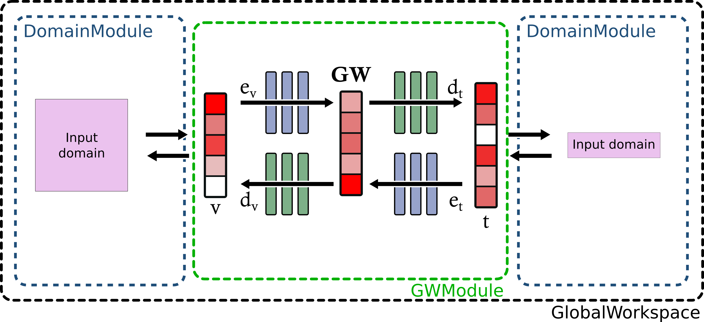

# Usage example

We will build a Global Workspace (GW) using `shimmer`. If will have 2 domains that are random
vectors of different dimensions.

You can find the final code for this tutorial in the repository in `examples/main_example`.

Note that we choose to type this tutorial to make explicit what each function is expecting.

First, let's take a look at a schematic of the different components that you need
to make a GW in shimmer:



Let's detail:
- [`DomainModule`](https://bdvllrs.github.io/shimmer/shimmer/modules/domain.html#DomainModule)s
    are the individual domain modules which encode domain data into a latent vector;
- the `GWModule` has access to the domain modules, and defines how to encode, decode and merge representations of the domains into a unique GW representation.
- finally `GlobalWorkspaceBase` takes all building blocks to make a [Pytorch Lightning](https://lightning.ai/docs/pytorch/stable/) module

The last building block (not in the diagram) is the `GWLosses` class which
defines how losses are computed to train the GW.

Now let's build and assemble all of these blocks.

## Data
Let's first define the data we will be using. We will have two domains: "domain1" and "domain2".
For this example, we will simply use some random vectors to represent each domain:

```python
from typing import Literal

import torch

domain_sizes = {"domain1": 8, "domain2": 16}


def get_domain_data(
    domain_name: Literal["domain1", "domain2"],
) -> tuple[torch.Tensor, torch.Tensor]:
    """
    Load data from a domain.
    Here we randomly create it
    """
    n_train = 256
    n_val = 128
    if domain_name == "domain1":
        train_data = torch.randn(n_train, domain_sizes[domain_name])
        val_data = torch.randn(n_val, domain_sizes[domain_name])
        return train_data, val_data
    if domain_name == "domain2":
        train_data = torch.randn(n_train, domain_sizes[domain_name])
        val_data = torch.randn(n_val, domain_sizes[domain_name])
        return train_data, val_data
```

To work with Pytorch Lightning, we will create a `LightningDataModule` class which
will contain the sets to train our model.

```python
from lightning.pytorch import LightningDataModule
from torch.utils.data import DataLoader, TensorDataset


class DomainDataModule(LightningDataModule):
    def __init__(
        self,
        val_dataset: torch.Tensor,
        train_dataset: torch.Tensor,
        batch_size: int,
    ) -> None:
        super().__init__()

        self.batch_size = batch_size

        self.n_train = 128
        self.n_val = 128
        self.n_paired = 64

        self.val_dataset = TensorDataset(val_dataset)
        self.train_dataset = TensorDataset(train_dataset)

    def train_dataloader(self) -> DataLoader:
        return DataLoader(self.train_dataset, batch_size=self.batch_size, shuffle=True)

    def val_dataloader(self) -> DataLoader:
        return DataLoader(self.val_dataset, batch_size=self.batch_size)
```


Now that our data module is defined, let's create `DomainModule`s.

## `DomainModule`
For more details about DomainModules, see the [DomainModule API docs](https://bdvllrs.github.io/shimmer/shimmer/modules/domain.html#DomainModule).
The `DomainModule` class extends from a LightningModule and requires you to define some
methods:

```python
import torch
import torch.nn.functional as F
from torch.nn import Linear

from shimmer import DomainModule


class GenericDomain(DomainModule):
    def __init__(self, input_size: int, latent_dim: int) -> None:
        super().__init__(latent_dim)

        self.input_size = input_size
        # after the __init__, self.latent_dim is set
        self.encoder = Linear(self.input_size, self.latent_dim)
        self.decoder = Linear(self.latent_dim, self.input_size)

    # Pytorch Lightning stuff to train the Domain Module

    def training_step(
        self,
        batch: torch.Tensor,
        batch_idx: int,
    ):
        # TensorDataset always gives a list of tensor, even if there is only one input.
        (domain,) = batch
        decoded = self.decoder(self.encoder(domain))
        loss = F.mse_loss(domain, decoded)
        self.log("train_loss", loss)
        return loss

    def validation_step(
        self,
        batch: torch.Tensor,
        batch_idx: int,
    ):
        # TensorDataset always gives a list of tensor, even if there is only one input.
        (domain,) = batch
        decoded = self.decoder(self.encoder(domain))
        loss = F.mse_loss(domain, decoded)
        self.log("val_loss", loss)
        return loss

    def configure_optimizers(self) -> torch.optim.Optimizer:
        """
        Define which optimizer to use
        """
        return torch.optim.AdamW(self.parameters(), lr=1e-3, weight_decay=1e-6)
```

With all this defined, we can make a script to train our unimodal module:
```python
import os
import shutil
from typing import Literal

from dataset import DomainDataModule, domain_sizes, get_domain_data
from domains import GenericDomain
from lightning.pytorch import Trainer
from lightning.pytorch.callbacks import ModelCheckpoint


def train_unimodal_module(module_name: Literal["domain1", "domain2"]):
    train_data, val_data = get_domain_data(module_name)

    data = DomainDataModule(train_data, val_data, batch_size=32)
    domain_module = GenericDomain(input_size=domain_sizes[module_name], latent_dim=32)

    trainer = Trainer(
        max_epochs=4,
        log_every_n_steps=4,  # log metrics every 4 training steps
        devices=1,  # use only one GPU when training
        callbacks=[
            ModelCheckpoint(
                dirpath="checkpoints",
                filename=module_name,
                monitor="val_loss",
                mode="min",
                save_top_k=1,
            ),
        ],
    )
    trainer.fit(domain_module, data)
    trainer.validate(domain_module, data, "best")


if __name__ == "__main__":
    # reset the checkpoints directory
    shutil.rmtree("checkpoints")
    os.mkdir("checkpoints")

    # Let's train domain1 and domain2
    train_unimodal_module("domain1")
    train_unimodal_module("domain2")
```

We now have unimodal modules!

## Preparation to train a GW

To train our GW, we need data used for unsupervised losses coming from one domain,
and paired data for supervised losses.

Let's first define a dataset and data module for this.

## Data for GW

Data coming to the GW can contain different modalities:
- unimodal data where only one domain is available,
- some matched data of unimodal representations of different domains.

To keep track of all these datasets, we put them in a dict (val/train_datasets)
that is indexed by a frozenset of the different domain names
(sets cannot be used as dict keys as they are mutable, so we need to use frozensets).

For example:
```python
datasets = {
    frozenset(["domain1"]): ...,  # Dataset with only domain1
    frozenset(["domain2"]): ...,  # Dataset with only domain2
    frozenset(["domain1", "domain2"]): ...,  # Dataset with both domains
}
```

Let's separate training and val data using out `get_domain_data` function from earlier:
```python
train_domain1, val_domain1 = get_domain_data("domain1")
train_domain2, val_domain2 = get_domain_data("domain2")

train_data = {"domain1": train_domain1, "domain2": train_domain2}
val_data = {"domain1": val_domain1, "domain2": val_domain2}
```

Let's now define a `Dataset` that will take `train_data` or `val_data`:

```python
from collections.abc import Mapping

import torch
from torch.utils.data import Dataset


class DomainDataset(Dataset):
    def __init__(self, domain_data: Mapping[str, torch.Tensor]) -> None:
        """
        Creates a dataset that takes a mapping from a domain name to a tensor of data.
        """
        self.domain_data = domain_data

    def __len__(self) -> int:
        # All domains should have the same length in one dataset!
        for domain in self.domain_data.values():
            return domain.size(0)
        return 0

    def __getitem__(self, k: int) -> dict[str, torch.Tensor]:
        # There can be several domains to return,
        # so we always return a dict with the data.
        return {domain_name: data[k] for domain_name, data in self.domain_data.items()}
```

`DomainDataset` will represent one dataset.
From our previous example, we can define the datasets now with:

```python
datasets = {
    frozenset(["domain1"]): DomainDataset({"domain1": train_domain1}),
    frozenset(["domain2"]): DomainDataset({"domain2": train_domain2}),
    frozenset(["domain1", "domain2"]): DomainDataset({
        "domain1": train_domain1,
        "domain2": train_domain2,
    }),
}
```
In this example, all items of `train_domain1`  and `train_domain2` are paired, but we
could imagine a case where data from `train_domain1` is unrelated to `train_domain2`, 
and have extra matched representation in `train_domain{k}_matched`:

```python
    frozenset(["domain1", "domain2"]): DomainDataset({
        "domain1": train_domain1_matched,
        "domain2": train_domain2_matched,
    }),

```

We will make a helper function that will create these dataset, and will use only
a fraction of the data as paired as given by a `paired_items` parameter which will
be a list of keys that will be paired:

```python
def make_datasets(
    domain_data: Mapping[str, torch.Tensor],
    paired_items: list[int] | None = None,
    add_unpaired_dataset: bool = False,
) -> dict[frozenset[str], DomainDataset]:
    """
    This will create a dataset for each domain, and one for paired items.
    Args:
        domain_data: a mapping from domain name to data
        paired_items: a list of data index corresponding to paired items. If None
            everything is paired
        add_unpaired_dataset: whether we add datasets with only unpaired data
    Returns:
        a dict of frozenset containing the domains in the dataset to a dataset
        (frozenset can be used for dict keys but not sets because they are
        immutable)
    """
    datasets: dict[frozenset[str], DomainDataset] = {}

    # First, we make the paired dataset
    paired_data = {
        domain_name: data[paired_items] for domain_name, data in domain_data.items()
    }
    datasets[frozenset(domain_data.keys())] = DomainDataset(paired_data)

    if add_unpaired_dataset:
        # Then, we create unpaired dataset that only contain one domain
        for domain_name, data in domain_data.items():
            datasets[frozenset([domain_name])] = DomainDataset({domain_name: data})
    return datasets
```

Note that we need `add_unpaired_dataset` for the validation/test sets. Indeed, these
sets should be fully paired and we don't want to have unpaired data in it.

We are now ready to create the `GWDataModule` class:
```python
from lightning.pytorch import LightningDataModule
from lightning.pytorch.utilities.combined_loader import CombinedLoader
from torch.utils.data import DataLoader

from shimmer import RepeatedDataset


class GWDataModule(LightningDataModule):
    def __init__(
        self,
        val_datasets: dict[frozenset[str], DomainDataset],
        train_datasets: dict[frozenset[str], DomainDataset],
        batch_size: int,
    ) -> None:
        super().__init__()

        self.batch_size = batch_size

        self.val_datasets = val_datasets
        self.train_datasets = train_datasets

    def train_dataloader(self) -> CombinedLoader:
        assert self.train_datasets is not None

        dataloaders: dict[frozenset[str], DataLoader] = {}
        max_sized_dataset = max(
            len(dataset) for dataset in self.train_datasets.values()
        )
        for domain, dataset in self.train_datasets.items():
            dataloaders[domain] = DataLoader(
                # RepeatedDataset will artificially extend the dataset
                # to be of size "max_sized_dataset" by cycling over its element.
                # This is done so that every dataset has the same length.
                RepeatedDataset(dataset, max_sized_dataset, drop_last=False),
                batch_size=self.batch_size,
                num_workers=0,
                pin_memory=True,
                shuffle=True,
                drop_last=True,
            )
        # This Loader will retrieve a batch from each dataloader at each batch.
        # Epoch will end when the smallest dataloader is consumed.
        return CombinedLoader(dataloaders, mode="min_size")

    def val_dataloader(self) -> CombinedLoader:
        assert self.val_datasets is not None

        dataloaders: dict[frozenset[str], DataLoader] = {}
        for domain, dataset in self.val_datasets.items():
            dataloaders[domain] = DataLoader(
                dataset,
                pin_memory=True,
                batch_size=self.batch_size,
                num_workers=0,
            )
        # This time we use the sequential mode which train with a batch
        # of each dataloader one after the other.
        # `dataloaders` should only have one element anyway.
        return CombinedLoader(dataloaders, mode="sequential")
```

## Going back to `DomainModule`s

We have previously define `GenericDomain` so we can train the module. We now need
to add some mandatory methods that will be used by the GlobalWorkspace

```python
from shimmer import LossOutput


class GenericDomain(DomainModule):
    # Pytorch Lightning stuff to train the Domain Module
    ...

    # shimmer stuff to train the GW

    def encode(self, x: torch.Tensor) -> torch.Tensor:
        """
        Encode data to the unimodal representation.
        Args:
            x: input data of the domain.
        """
        return self.encoder(x)

    def decode(self, z: torch.Tensor) -> torch.Tensor:
        """
        Decode data back to the unimodal representation.
        Args:
            z: latent reprensetation of the domain.
        Returns:
            the reconstructed input data
        """
        return self.decoder(z)

    def compute_loss(self, pred: torch.Tensor, target: torch.Tensor) -> LossOutput:
        """
        Computes a generic loss in the domain's latent representation.
        This must return a LossOutput object. LossOutput is used to separate
        the loss used for training the model (given to loss parameter), and
        additional metrics that are logged, but not trained on.
        """
        return LossOutput(loss=F.mse_loss(pred, target))
```

To learn more about LossOutput, see [API docs](https://bdvllrs.github.io/shimmer/shimmer/modules/domain.html#LossOutput).

## Let's make a GW!

We already have all the building blocks, we just need to add them together!
Let's make our `train_gw` function to train the final model:

```python
from dataset import GWDataModule, domain_sizes, get_domain_data, make_datasets
from domains import GenericDomain
from lightning.pytorch import Trainer
from lightning.pytorch.callbacks import ModelCheckpoint
from torch import nn

from shimmer import GlobalWorkspace, GWDecoder, GWEncoder, LossCoefs
from shimmer.modules.global_workspace import SchedulerArgs


def train_gw():
    train_domain1, val_domain1 = get_domain_data("domain1")
    train_domain2, val_domain2 = get_domain_data("domain2")

    train_data = {"domain1": train_domain1, "domain2": train_domain2}
    val_data = {"domain1": val_domain1, "domain2": val_domain2}

    n_paired = 32

    train_datasets = make_datasets(
        train_data, paired_items=list(range(n_paired)), add_unpaired_dataset=True
    )

    # The val set is completely paired and we do not add the unpaired datasets
    val_datasets = make_datasets(val_data, list(range(val_domain1.size(0))))

    batch_size = 32

    data = GWDataModule(val_datasets, train_datasets, batch_size=batch_size)

    # We have pretrained the domain module, we need to load them.
    domain_mod1 = GenericDomain.load_from_checkpoint(
        "checkpoints/domain1.ckpt",
        input_size=domain_sizes["domain1"],
        latent_dim=32,
    )
    domain_mod2 = GenericDomain.load_from_checkpoint(
        "checkpoints/domain2.ckpt",
        input_size=domain_sizes["domain2"],
        latent_dim=32,
    )

    domain_mods = {
        "domain1": domain_mod1,
        "domain2": domain_mod2,
    }

    workspace_dim = 16

    # Now we define modality encoders and decoders that will encode and decode
    # the domain representations to and from the global workspace
    gw_encoders: dict[str, nn.Module] = {}
    gw_decoders: dict[str, nn.Module] = {}
    for name, mod in domain_mods.items():
        gw_encoders[name] = GWEncoder(
            mod.latent_dim,
            hidden_dim=64,
            out_dim=workspace_dim,
            # total number of Linear layers is this value + 2 (one before, one after)
            n_layers=1,
        )
        gw_decoders[name] = GWDecoder(
            in_dim=workspace_dim,
            hidden_dim=64,
            out_dim=mod.latent_dim,
            # total number of Linear layers is this value + 2 (one before, one after)
            n_layers=1,
        )

    loss_coefs: LossCoefs = {
        "translations": 1.0,
        "demi_cycles": 1.0,
        "cycles": 1.0,
        "contrastives": 0.01,
    }

    n_epochs = 4

    global_workspace = GlobalWorkspace(
        domain_mods,
        gw_encoders,
        gw_decoders,
        workspace_dim,
        loss_coefs,
        # Secify learning rate scheduler arguments. It will use a
        # [OneCycleLR](https://pytorch.org/docs/stable/generated/torch.optim.lr_scheduler.OneCycleLR.html#torch.optim.lr_scheduler.OneCycleLR)
        scheduler_args=SchedulerArgs(
            max_lr=1e-3,  # max learning rate of the OneCycle
            # number of steps for training:
            # number of epochs * dataset size (`train_domain1.size(0)`) / batch size
            total_steps=n_epochs * train_domain1.size(0) // batch_size,
        ),
    )

    trainer = Trainer(
        devices=1,  # only train on 1 GPU
        max_epochs=n_epochs,
        log_every_n_steps=1,  # evaluate metrics every step
        callbacks=[
            ModelCheckpoint(
                dirpath="checkpoints",
                filename="gw",
                monitor="val/loss",
                mode="min",
                save_top_k=1,
            ),
        ],
    )
    trainer.fit(global_workspace, data)
    trainer.validate(global_workspace, data, "best")


if __name__ == "__main__":
    train_gw()
```

Let's decompose this.

First, we get the data and instanciate our `GWDataModule` class from the previous
section.

```python
    train_domain1, val_domain1 = get_domain_data("domain1")
    train_domain2, val_domain2 = get_domain_data("domain2")

    train_data = {"domain1": train_domain1, "domain2": train_domain2}
    val_data = {"domain1": val_domain1, "domain2": val_domain2}

    n_paired = 32

    train_datasets = make_datasets(
        train_data, paired_items=list(range(n_paired)), add_unpaired_dataset=True
    )

    # The val set is completely paired and we do not add the unpaired datasets
    val_datasets = make_datasets(val_data, list(range(val_domain1.size(0))))

    batch_size = 32

    data = GWDataModule(val_datasets, train_datasets, batch_size=batch_size)
```

Then we load pretrained domains and put them in a dictionary indexed by the domain name.
This should be the same as what was used for the data.
```python
    # We have pretrained the domain module, we need to load them.
    domain_mod1 = GenericDomain.load_from_checkpoint(
        "checkpoints/domain1.ckpt",
        input_size=domain_sizes["domain1"],
        latent_dim=32,
    )
    domain_mod2 = GenericDomain.load_from_checkpoint(
        "checkpoints/domain2.ckpt",
        input_size=domain_sizes["domain2"],
        latent_dim=32,
    )

    domain_mods = {
        "domain1": domain_mod1,
        "domain2": domain_mod2,
    }
```

We define encoders and decoders to link the domain modules with the GlobalWorkspace
```python
    workspace_dim = 16

    # Now we define modality encoders and decoders that will encode and decode
    # the domain representations to and from the global workspace
    gw_encoders: dict[str, nn.Module] = {}
    gw_decoders: dict[str, nn.Module] = {}
    for name, mod in domain_mods.items():
        gw_encoders[name] = GWEncoder(
            mod.latent_dim,
            hidden_dim=64,
            out_dim=workspace_dim,
            # total number of Linear layers is this value + 2 (one before, one after)
            n_layers=1,
        )
        gw_decoders[name] = GWDecoder(
            in_dim=workspace_dim,
            hidden_dim=64,
            out_dim=mod.latent_dim,
            # total number of Linear layers is this value + 2 (one before, one after)
            n_layers=1,
        )
```

We define loss coefficients for the different losses. Note that `LossCoefs` is a
`TypedDict` so you can be sure that you give a dict with correct keys.
```python
    loss_coefs: LossCoefs = {
        "translations": 1.0,
        "demi_cycles": 1.0,
        "cycles": 1.0,
        "contrastives": 0.01,
    }
```

Finally we make the GlobalWorkspace and train it.
```python
    global_workspace = GlobalWorkspace(
        domain_mods,
        gw_encoders,
        gw_decoders,
        workspace_dim,
        loss_coefs,
        # Secify learning rate scheduler arguments. It will use a
        # [OneCycleLR](https://pytorch.org/docs/stable/generated/torch.optim.lr_scheduler.OneCycleLR.html#torch.optim.lr_scheduler.OneCycleLR)
        scheduler_args=SchedulerArgs(
            max_lr=1e-3,  # max learning rate of the OneCycle
            # number of steps for training:
            # number of epochs * dataset size (`train_domain1.size(0)`) / batch size
            total_steps=n_epochs * train_domain1.size(0) // batch_size,
        ),
    )
```
The learning scheduler currently uses [OneCycleLR](https://pytorch.org/docs/stable/generated/torch.optim.lr_scheduler.OneCycleLR.html#torch.optim.lr_scheduler.OneCycleLR)
and there is no way of changing it currently.

Moreover, the optimizer used is AdamW.


```python
    trainer = Trainer(
        devices=1,  # only train on 1 GPU
        max_epochs=n_epochs,
        log_every_n_steps=1,  # evaluate metrics every step
        callbacks=[
            ModelCheckpoint(
                dirpath="checkpoints",
                filename="gw",
                monitor="val/loss",
                mode="min",
                save_top_k=1,
            ),
        ],
    )
    trainer.fit(global_workspace, data)
    trainer.validate(global_workspace, data, "best")


if __name__ == "__main__":
    train_gw()
```

You can now run this to train your Global Workspace!
